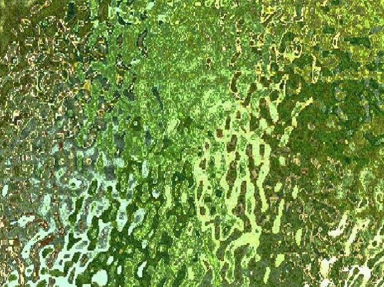
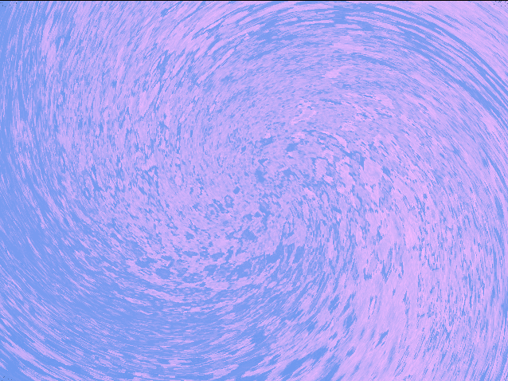

# Introducció

## Aspectes tèncins
L'arquitectura d'aquest projecte s'ha construit sobre **C++** i les llibreries **SDL2 (Simple DirectMedia Layer)**, **SDL2\_image** i **SDL2\_mixer**.

Un dels aspectes més importants a destacar d'aquest projecte és la **manipulació directa de buffers de memòria** en lloc 
d'utilitzar el `SDL_Renderer`. S'ha optat per accedir directament a les estructures de superfície (`SDL_Surface`) per controlar
renderitzat píxel a píxel amb algorismes. Aquest control es produeix a nivell de **CPU**, en lloc d'utilitzar *shaders* que pasen per la targeta gràfica.

# Disseny
La identitat visual de la demo s'inspira en la portada de l'àlbum de la cançó escollida per la demo: El Cant i el Suïcidi (Fiat Lux) de 
**Tarta Relena**. 

{width=50%}

A nivell conceptual, el disseny busca una intersecció entre el llegat (folclore) i la contemporaneïtat. Per transmetre aquest misticisme, he optat per una estètica que combina:

* Textures orgàniques
 
* Gravats amb motius florals, gerres, etc.

* Atmosfera mística i de contemplació

L'elecció de Tarta Relena també respon a una afinitat estètica amb la *demoscene*. En els seus videoclips i visuals de 
directe (com els creats per l'estudi Taller Estampa o Cándida), el grup utilitza sovint tècniques de generació d'imatges 
procedimentals, models 3D low poly i jocs de textures que recorden l'experimentació visual de la demoscene.

](doc/thumbnailsafo.jpg){width=70%}

A nivell narratiu la demo conté una segona capa conceptual que enllaça amb el místicisme i l'atmosfera intíma de Tarta Relena: he incorporat images 
i iconografia de procedents de l'anime **Revolutionary Girl Utena**. Aquesta elecció no es fortuïta, ja que l'anime es una obra mestra 
de la simbologia queer. La relació entre Utena i Anthy (les protagonistes de la série) i els motius de desig de l'eternitat, encaixen perfectament
amb l'obra de **Tarta Relena**.

Així s'ha buscat representar: 

* Un sentiment sàfic: A nivell tant visual com sonor es busca construir un espai íntim, fusionant el desig, folclore i contemporaneïtat.

* Un sentiment d'eternitat: A nivell visual, la demo presenta una atmosfera mística que representa el desig de l'eternitat.

## Color
A aquesta Demo, he prioritzat mantindre una paleta de colors cohesionada i coherent en tots els efectes. Així el color serveix
com a fil conductor narratiu i visual de l'escena.

Durant l'estudi dels apunts i dels exemples presentats, un dels aspectes que més em va cridar l'atenció va ser 
la falta de cohesió cromàtica dels exemples. Així m'he interessat per canviar és el control algorítmic del
color i construir paletes de colors cromàtiques. Per resoldre-ho he implementat la classe estàtica `PaletteBuilder`, encarregada de generar paletes de colors cromàtiques. 

**Implementació de `PaletteBuilder`:**

La classe utilitza un algorisme d'interpolació lineal en l'espai RGB per generar un gradient de colors. Així el mètode
`buildLinearPalette` rep dos colors RGB i el paràmetre $n$ (nombre de colors de la paleta final) i retorna un vector amb els colors.

# Estructura del programa 

## `Demo`
Nucli del programa i responsable de coordinar la resta de sistemes. La seva funció és gestionar el cicle de vida de la 
demo: inicialitza els sistemes, carrega els recursos i assegura el tancament correcte dels managers i efectes.

Per permetre transicions entre dos efectes on es superposen, aquesta classe gestiona tres superfícies de memòria: 

* `Screen`: Buffer final que es mostra.

* `src1` i `src2`: Superfícies auxiliars sobre les que els efectes renderitzen abans de combinar-los si es troba en una trancició,


## `Timeline`
Per controlar els canvis d'escena i la sincronització amb la música, he desenvolupat la classe `Timeline` que actua
com a esquelet de la demo, emmagatzemant la informació de transició entre els diferents efectes.

## `MusicManager`
Encarregat de la pcapa sonora. Carrega la llibreria `SDL2_mixer` i reprodueix la música de la demo. 


# Efectes
Els efectes utilitzen la interfície `Effect`.

## Efecte plasma cromàtic (`PlasmaEffect`):
Per a aquest efecte he modificat l'efecte de plasma vist als apunts: 

* **Equacions**: He ajustat les funcions de plasma fins a trobar un resultat que m'agradés i que funcionara amb els colors 
de la meua nova paleta.

* Paleta de colors: He triat tres tons base i he construït una paleta de manera que es forma un cercle tancat: `White` → `SkyBlue` → `OrchidPink` → `White`
D'aquesta manera, l'efecte manté una estètica coherent i cohesionada, la qual utilitze en la resta d'efectes del projecte.

```
void ImageEffect::buildPalette(int currentTime) {
  for (int i = 0; i < 256; i++) {
    m_palette[i] = m_basePalette[i % 256];
  }
}
```

L'efecte utilitza precàlcul per a les funcions d'ona i per a construir la paleta de colors, ja que és la mateixa per a tot l'efecte.

## Imatge Cromàtica (`ImageEffect`):

Aquest efecte carrega una imatge, la converteix a escala de grisos (0-255) i utilitza els valors d'aquesta escala (_Heightmap_) com a índex per a una paleta de colors
dinàmica que canvia amb el temps. La imatge se centra automàticament a la pantalla.
La paleta de colors es construeix de la mateixa manera que a l'efecte de plasma cromàtic.


## Efecte _plasma image blend_ (`PlasmaImageEffect`):
Aquest efecte és el més complex de la demo, ja que combina la generació procedimental del efecte del plasma amb el processament
d'imatges estàtiques.

* **Mescla d'imatges amb plasma**: L'algorisme utilitza dos buffers de plasma precalculats que es desplacen de forma 
independent. La suma d'aquests plasmes no genera directament el color, sinó que actua com un factor d'interpolació ($\alpha$) entre dues imatges en escala de grisos.

* **Control del píxel**: Per a cada píxel es calcula un valor en escala de grisos (_Heighmap_) on el valor del plasma 
s'utilitza com a factor d'interpolació entre dues imatges en escala de grisos. Després d'això s'aplica un valor de la paleta
cromàtica construïda.

## Efecte d'espiral cromàtica (`RotateImage`):
Aquest efecte combina la manipulació geomètrica de coordenades amb el processament de color a partir de la seua luminància, generant una 
distorsió sobre la imatge original.

{width=50%}

{width=50%}

* **Colorització**: Es calcula el valor de luminiscencia per a cada píxel i es converteix a una paleta discreta de colors. 
Es genera una imatge amb el color final que s'emmagatzema per al processat.

* **Manipulació geometrica**: Utilitzant un mapeig invers, es calcula la posició de cada píxel en funció de la distància al centre de la imatge.

* **Angle de rotació variable**: L'angle de rotacio segueix la funcio $\theta_{f} = \theta_{base}(t) + \theta_{spiral}(t,r)$
on $\theta_{spiral} = f(t) * r$. La funció $f(t)$ és una funció de tipus sinusoidal que controla l'amplada del efecte espiral,
quan $f(t)=0$ es recupera el una rotació estàndard sense distorsió.


## Efecte de _lettering_ (`LetteringEffect`):
Aquest efecte implementa un sistema de partícules (imatges tipogràfiques) que es desplacen per la pantalla. Està dissenyat 
per funcionar com a capa superior d'un altre efecte.

* **Composició**: La classe $`LetteringEffect`$ utilitza un punter a una superfície (altre efecte) que gestiona com a fons.
En cada frame es delega al background que actualitze i renderitze. Després el renderitzat del lettering es fa per sobre d'aquesta
superfície inicial.

* **Gradient vertical de color**: Per a cada partícula o frase, l'efecte aplica un gradient vertical de color a partir de dos
colors que extrau d'una paleta base. Es manté la luminància original de la lletra (actuant com a màscara) per preservar 
els detalls del sprite utilitzat per a les lletres.

* **Moviment**: Les lletres es gestionen com a objectes dinàmics com a un sistema de partícules: spawn, i escalat dinàmic.
Per l'escalat s'utilitza SDL_BlitScaled.

# Transicions
Les transicions estan controlades pel `TransitionManager`. Les transicions reben 3 surfaces: Screen (`screen`) i els dos
efectes (`src1` i `src2`) i un paràmetre $\alpha \in [0,1]$, que mesura el progrés de transició. Així doncs, les transicions modifiquen 
els buffers dels efectes seleccionant quins pixels es copien al buffer de la pantalla.

S'han implementat 4 tipus de transició:

* **Alpha blend:** Realitza una interpolació lineal entre els canals RGB d'ambdues superfícies. És una transició on el 
color final $C$ es calcula com: $C = (1-\alpha)C_1 + \alpha C_2$.

Les següents transicions estan basades en una condició de llindar (*threshold*) en funció d'una distància que depen de $x$ i de $y$:
$$\Delta(x, y) < \alpha$$

* **Diagonal 1:** Un front de tall que avança des del cantó superior esquerre. Utilitza la fórmula de la recta:
  $$\Delta(x, y) = \frac{x + y}{\text{width} + \text{height}} < \alpha \text{.}$$

* **Diagonal 2:** Inversa de l'anterior:
  $$\Delta(x, y) = \frac{(\text{width} - x) + y}{\text{width} + \text{height}} <\alpha \text{.}$$

* **Diffuse Ellipse:** Una el·lipse que neix del centre i s'expandeix cap a la vora de la pantalla. Utilitza una funció
de distància el·líptica amb un component de soroll a la vora:
$$\Delta(x,y) = \frac{(x - x_c)^2}{a^2} + \frac{(y - y_c)^2}{b^2} + \xi < \alpha \text{,}$$ on $x_c$ i $y_c$ fan 
refèrencia la posició del centre, $\xi$ és un component de soroll i $a, b$ són els semieixos de l'el·lipse i canvien amb 
funció del temps.
